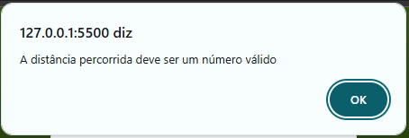
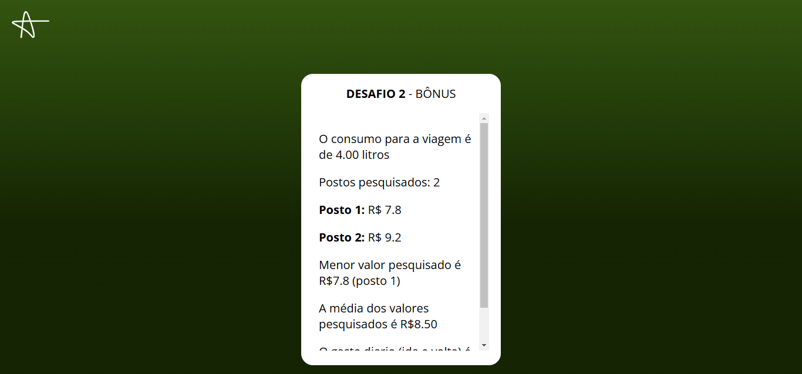

<h1><b>CALCULADORA DE GASOLINA</b></h1>

<h2>📕 Sobre</h2>
A ideia principal do projeto é o desenvolvimento de um código que possibilite o cálculo do gasto de gasolina com base no consumo do carro e no preço da gasolina em diferentes postos.

<h2>💻 Tecnologias</h2>

<h2>🧩 Lógica</h2>
Ao executar o arquivo <b>DESAFIO_LOGICA ACAUÃ RANGEL.html</b>, aparecerá a seguinte tela:

Em que os inputs requerem os dados de <b>consumo do carro</b> e <b>distância do ponto de partida ao local de destino</b>, os dados devem ser fornecidos em formato flutuante (números irracionais), caso seja fornecido um texto ou um valor inválido, o código retornará o seguinte erro:

ou

Ao informar os valores corretos, será para a próxima etapa, onde o usuário deve informar a quantidade de postos pesquisados.

Ao iniciar uma nova etapa, o formulário irá sinalizar em que momento o usuário se encontra, colocando em destaque o número referente à etapa. A quantidade a ser informada também deve ser um número válido, porém inteiro. Caso seja um número flutuante, ele irá ignorar os valores decimais. Em caso de número inválido, também retornará um erro, tendo em vista que o valor mínimo é 1.

Com base nos valores flutuantes informados nessa parte, a página fará o cálculo da média, análise do menor valor e cálculo do custo diário de ida e volta com base nesse valor.

